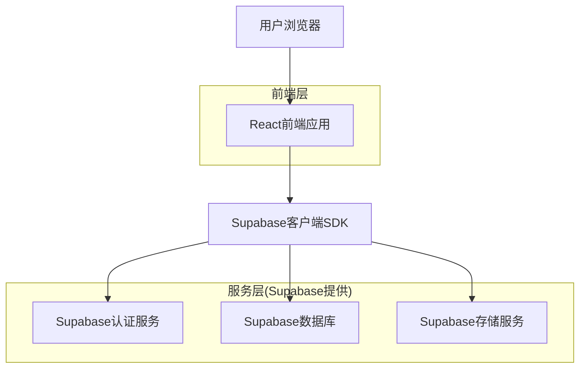
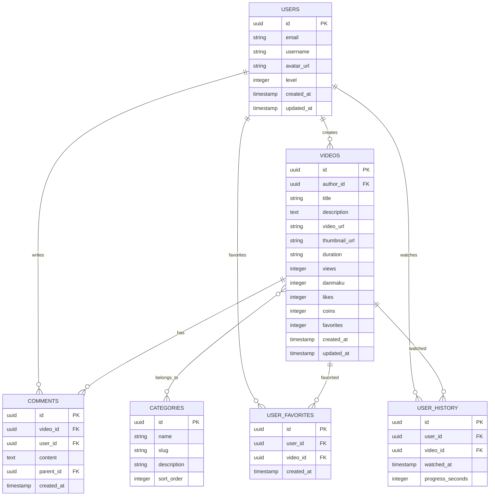

## 1. 架构设计



## 2. 技术描述

- **前端**: React@18 + TypeScript + TailwindCSS@3 + Vite
- **初始化工具**: vite-init
- **UI组件库**: shadcn/ui
- **图标库**: Lucide React
- **后端**: Supabase (BaaS)
- **数据库**: PostgreSQL (Supabase提供)
- **文件存储**: Supabase Storage
- **身份认证**: Supabase Auth

## 3. 路由定义

| 路由 | 用途 |
|------|------|
| / | 首页，显示推荐视频和分类 |
| /video/:id | 视频详情页，播放指定视频 |
| /search | 搜索结果页，显示搜索内容 |
| /category/:slug | 分类页面，显示特定分类视频 |
| /user/profile | 用户个人中心 |
| /user/history | 观看历史页面 |
| /user/favorites | 收藏夹页面 |
| /auth/login | 用户登录页面 |
| /auth/register | 用户注册页面 |

## 4. API定义

### 4.1 视频相关API

**获取视频列表**
```
GET /api/videos
```

请求参数：
| 参数名 | 参数类型 | 是否必需 | 描述 |
|--------|----------|----------|------|
| page | number | false | 页码，默认为1 |
| limit | number | false | 每页数量，默认为20 |
| category | string | false | 分类筛选 |
| search | string | false | 搜索关键词 |
| sort | string | false | 排序方式：hot/new |

响应：
```json
{
  "data": [
    {
      "id": "video_123",
      "title": "视频标题",
      "thumbnail": "https://example.com/thumb.jpg",
      "duration": "12:34",
      "views": 123456,
      "danmaku": 789,
      "author": {
        "id": "user_456",
        "name": "作者名称",
        "avatar": "https://example.com/avatar.jpg"
      },
      "created_at": "2024-01-01T00:00:00Z"
    }
  ],
  "total": 100,
  "page": 1,
  "limit": 20
}
```

**获取视频详情**
```
GET /api/videos/:id
```

响应：
```json
{
  "id": "video_123",
  "title": "视频标题",
  "description": "视频描述内容",
  "video_url": "https://example.com/video.mp4",
  "thumbnail": "https://example.com/thumb.jpg",
  "duration": "12:34",
  "views": 123456,
  "danmaku": 789,
  "likes": 1234,
  "coins": 567,
  "favorites": 890,
  "author": {
    "id": "user_456",
    "name": "作者名称",
    "avatar": "https://example.com/avatar.jpg",
    "followers": 10000
  },
  "tags": ["标签1", "标签2"],
  "created_at": "2024-01-01T00:00:00Z"
}
```

## 5. 数据模型

### 5.1 数据模型定义



### 5.2 数据定义语言

**用户表 (users)**
```sql
-- 创建表
CREATE TABLE users (
    id UUID PRIMARY KEY DEFAULT gen_random_uuid(),
    email VARCHAR(255) UNIQUE NOT NULL,
    username VARCHAR(50) UNIQUE NOT NULL,
    password_hash VARCHAR(255) NOT NULL,
    avatar_url TEXT,
    level INTEGER DEFAULT 1,
    created_at TIMESTAMP WITH TIME ZONE DEFAULT NOW(),
    updated_at TIMESTAMP WITH TIME ZONE DEFAULT NOW()
);

-- 创建索引
CREATE INDEX idx_users_email ON users(email);
CREATE INDEX idx_users_username ON users(username);
```

**视频表 (videos)**
```sql
-- 创建表
CREATE TABLE videos (
    id UUID PRIMARY KEY DEFAULT gen_random_uuid(),
    author_id UUID REFERENCES users(id) ON DELETE CASCADE,
    title VARCHAR(255) NOT NULL,
    description TEXT,
    video_url TEXT NOT NULL,
    thumbnail_url TEXT NOT NULL,
    duration VARCHAR(10) NOT NULL,
    views INTEGER DEFAULT 0,
    danmaku INTEGER DEFAULT 0,
    likes INTEGER DEFAULT 0,
    coins INTEGER DEFAULT 0,
    favorites INTEGER DEFAULT 0,
    created_at TIMESTAMP WITH TIME ZONE DEFAULT NOW(),
    updated_at TIMESTAMP WITH TIME ZONE DEFAULT NOW()
);

-- 创建索引
CREATE INDEX idx_videos_author_id ON videos(author_id);
CREATE INDEX idx_videos_created_at ON videos(created_at DESC);
CREATE INDEX idx_videos_views ON videos(views DESC);
```

**分类表 (categories)**
```sql
-- 创建表
CREATE TABLE categories (
    id UUID PRIMARY KEY DEFAULT gen_random_uuid(),
    name VARCHAR(50) NOT NULL,
    slug VARCHAR(50) UNIQUE NOT NULL,
    description TEXT,
    sort_order INTEGER DEFAULT 0,
    created_at TIMESTAMP WITH TIME ZONE DEFAULT NOW()
);

-- 初始化数据
INSERT INTO categories (name, slug, description, sort_order) VALUES
('动画', 'animation', '动画相关内容', 1),
('音乐', 'music', '音乐视频', 2),
('游戏', 'game', '游戏视频', 3),
('科技', 'tech', '科技数码', 4),
('生活', 'life', '生活日常', 5),
('鬼畜', 'kichiku', '鬼畜调音', 6),
('时尚', 'fashion', '时尚美妆', 7),
('娱乐', 'entertainment', '娱乐八卦', 8),
('电影', 'movie', '电影相关', 9),
('电视剧', 'tv', '电视剧内容', 10);
```

**评论表 (comments)**
```sql
-- 创建表
CREATE TABLE comments (
    id UUID PRIMARY KEY DEFAULT gen_random_uuid(),
    video_id UUID REFERENCES videos(id) ON DELETE CASCADE,
    user_id UUID REFERENCES users(id) ON DELETE CASCADE,
    content TEXT NOT NULL,
    parent_id UUID REFERENCES comments(id) ON DELETE CASCADE,
    created_at TIMESTAMP WITH TIME ZONE DEFAULT NOW(),
    updated_at TIMESTAMP WITH TIME ZONE DEFAULT NOW()
);

-- 创建索引
CREATE INDEX idx_comments_video_id ON comments(video_id);
CREATE INDEX idx_comments_user_id ON comments(user_id);
CREATE INDEX idx_comments_parent_id ON comments(parent_id);
CREATE INDEX idx_comments_created_at ON comments(created_at DESC);
```

**用户收藏表 (user_favorites)**
```sql
-- 创建表
CREATE TABLE user_favorites (
    id UUID PRIMARY KEY DEFAULT gen_random_uuid(),
    user_id UUID REFERENCES users(id) ON DELETE CASCADE,
    video_id UUID REFERENCES videos(id) ON DELETE CASCADE,
    created_at TIMESTAMP WITH TIME ZONE DEFAULT NOW(),
    UNIQUE(user_id, video_id)
);

-- 创建索引
CREATE INDEX idx_user_favorites_user_id ON user_favorites(user_id);
CREATE INDEX idx_user_favorites_video_id ON user_favorites(video_id);
```

**观看历史表 (user_history)**
```sql
-- 创建表
CREATE TABLE user_history (
    id UUID PRIMARY KEY DEFAULT gen_random_uuid(),
    user_id UUID REFERENCES users(id) ON DELETE CASCADE,
    video_id UUID REFERENCES videos(id) ON DELETE CASCADE,
    watched_at TIMESTAMP WITH TIME ZONE DEFAULT NOW(),
    progress_seconds INTEGER DEFAULT 0,
    UNIQUE(user_id, video_id)
);

-- 创建索引
CREATE INDEX idx_user_history_user_id ON user_history(user_id);
CREATE INDEX idx_user_history_video_id ON user_history(video_id);
CREATE INDEX idx_user_history_watched_at ON user_history(watched_at DESC);
```

## 6. Supabase权限配置

```sql
-- 基本读取权限授予匿名用户
GRANT SELECT ON users TO anon;
GRANT SELECT ON videos TO anon;
GRANT SELECT ON categories TO anon;
GRANT SELECT ON comments TO anon;

-- 认证用户完整权限
GRANT ALL PRIVILEGES ON users TO authenticated;
GRANT ALL PRIVILEGES ON videos TO authenticated;
GRANT ALL PRIVILEGES ON categories TO authenticated;
GRANT ALL PRIVILEGES ON comments TO authenticated;
GRANT ALL PRIVILEGES ON user_favorites TO authenticated;
GRANT ALL PRIVILEGES ON user_history TO authenticated;

-- RLS策略示例（视频表）
ALTER TABLE videos ENABLE ROW LEVEL SECURITY;

-- 允许所有人读取视频
CREATE POLICY "任何人可读取视频" ON videos
    FOR SELECT USING (true);

-- 只允许作者更新自己的视频
CREATE POLICY "用户只能更新自己的视频" ON videos
    FOR UPDATE USING (auth.uid() = author_id);

-- 只允许作者删除自己的视频
CREATE POLICY "用户只能删除自己的视频" ON videos
    FOR DELETE USING (auth.uid() = author_id);
```