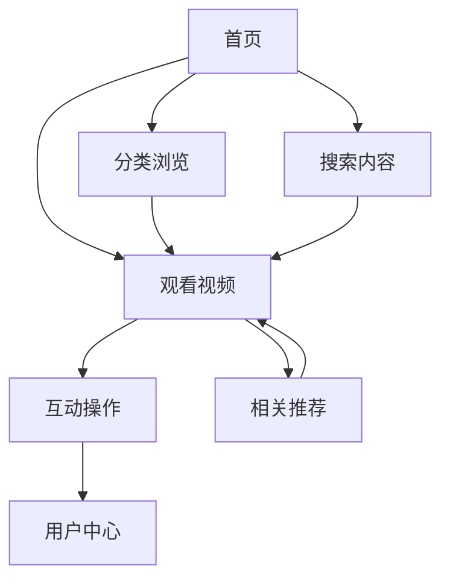

## 1. 产品概述
一个类似B站的视频分享平台，提供视频浏览、搜索、分类推荐等功能。主要面向年轻用户群体，提供丰富的视频内容和互动体验。

目标是为用户提供一个现代化、内容丰富的视频浏览平台，具有B站风格的界面设计和用户体验。

## 2. 核心功能

### 2.1 用户角色
| 角色 | 注册方式 | 核心权限 |
|------|----------|----------|
| 访客用户 | 无需注册 | 浏览视频、搜索内容、查看分类 |
| 注册用户 | 邮箱/手机号注册 | 收藏视频、查看历史、订阅频道 |
| 内容创作者 | 注册后申请 | 上传视频、管理作品、查看数据 |

### 2.2 功能模块
网站包含以下主要页面：
1. **首页**：顶部导航栏、搜索框、分类chips、轮播banner、视频卡片网格
2. **视频详情页**：视频播放器、视频信息、评论区、推荐视频
3. **搜索结果页**：搜索结果列表、筛选条件、相关推荐
4. **分类页面**：特定分类下的视频列表、子分类筛选
5. **用户中心**：个人信息、历史记录、收藏夹、订阅管理

### 2.3 页面详情
| 页面名称 | 模块名称 | 功能描述 |
|----------|----------|----------|
| 首页 | 顶部导航栏 | 显示logo、主导航菜单、用户操作入口 |
| 首页 | 搜索框 | 支持关键词搜索、热门搜索推荐、搜索历史 |
| 首页 | 分类chips | 横向滚动标签栏，包含动画、音乐、游戏等分类 |
| 首页 | 轮播banner | 大图轮播展示热门内容，支持自动切换和手动控制 |
| 首页 | 视频卡片网格 | 展示视频缩略图、标题、播放量、弹幕数、时长 |
| 视频详情页 | 视频播放器 | 支持播放/暂停、进度控制、音量调节、全屏播放 |
| 视频详情页 | 视频信息区 | 显示标题、作者、发布时间、标签、简介 |
| 视频详情页 | 互动操作 | 点赞、收藏、分享、举报功能 |
| 视频详情页 | 评论区 | 显示评论列表、发表评论、回复评论 |
| 搜索结果页 | 搜索筛选 | 按时间、播放量、弹幕数等条件筛选 |
| 用户中心 | 个人信息 | 显示头像、昵称、等级、关注数、粉丝数 |
| 用户中心 | 历史记录 | 按时间倒序显示观看历史 |
| 用户中心 | 收藏夹 | 管理收藏的视频内容 |

## 3. 核心流程
### 用户浏览流程
1. 用户访问首页，浏览推荐内容和热门视频
2. 通过分类chips或搜索框查找感兴趣的内容
3. 点击视频卡片进入详情页观看
4. 可以进行点赞、收藏、评论等互动操作
5. 通过侧边推荐或底部相关推荐继续浏览

### 内容发现流程
用户可以通过多种方式发现内容：
- 首页推荐算法展示个性化内容
- 分类浏览特定类型的视频
- 搜索关键词查找相关内容
- 通过排行榜发现热门内容

## 4. 用户界面设计

### 4.1 设计风格
- **主色调**：蓝色系（#00A1D6类似色），配合白色背景
- **辅助色**：粉色/红色用于强调按钮（发布、投稿）
- **字体**：无衬线字体，标题加粗，正文常规
- **按钮风格**：圆角矩形，扁平化设计
- **布局风格**：卡片式布局，顶部导航+内容网格
- **图标风格**：线性图标，简洁现代

### 4.2 页面设计概览
| 页面名称 | 模块名称 | UI元素 |
|----------|----------|--------|
| 首页 | 顶部导航 | 左侧logo（白色手写体），中间导航文字（白色），右侧用户操作区 |
| 首页 | 搜索框 | 圆角输入框，右侧搜索图标按钮，占位文字提示 |
| 首页 | 分类chips | 横向滚动标签，圆角按钮，选中状态高亮 |
| 首页 | 轮播banner | 大图展示，底部指示器，左右切换箭头，文字叠加层 |
| 首页 | 视频卡片 | 16:9缩略图，底部时长标签，标题两行显示，统计信息横向排列 |
| 视频详情页 | 播放器 | 黑色背景，标准视频控制栏，支持全屏 |
| 视频详情页 | 信息区 | 大标题字体，作者头像+名称，发布时间，标签云 |
| 用户中心 | 个人信息 | 圆形头像，昵称大号字体，统计数字横向排列 |

### 4.3 响应式设计
- **桌面优先**：默认设计为桌面端，宽度1200px以上
- **平板适配**：768px-1199px，调整网格列数和字体大小
- **移动端适配**：767px以下，采用单列布局，隐藏部分次要功能
- **触控优化**：移动端增大点击区域，支持手势操作