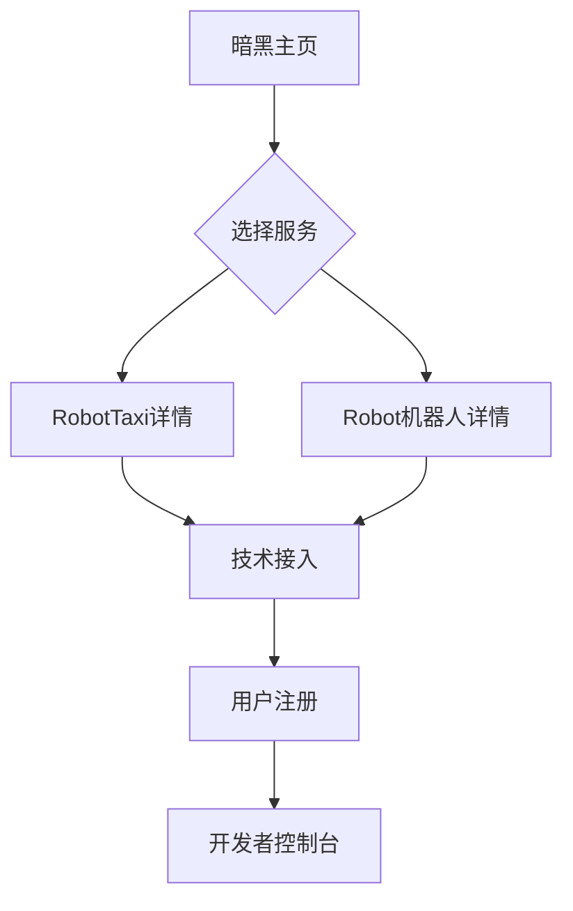

## 1. 产品概述

RoboOpenPlatform是一个面向未来的机器人技术开放平台，集成了RobotTaxi自动驾驶出租车服务和Robot智能机器人解决方案。平台致力于为用户提供前沿的机器人技术体验和服务。

* 主要目标：为开发者和企业提供机器人技术接口和服务

* 用户群体：技术开发者、企业用户、机器人爱好者

* 市场价值：推动机器人技术普及，构建开放的技术生态

## 2. 核心功能

### 2.1 用户角色

| 角色   | 注册方式 | 核心权限           |
| ---- | ---- | -------------- |
| 访客用户 | 无需注册 | 浏览主页信息，查看基础介绍  |
| 开发者  | 邮箱注册 | 访问API文档，申请技术接入 |
| 企业用户 | 企业认证 | 获取商业服务，定制解决方案  |

### 2.2 功能模块

平台主页包含以下核心页面：

1. **主页**：暗黑风格导航栏、RobotTaxi展示区、Robot机器人展示区、技术特色介绍。
2. **RobotTaxi详情页**：服务介绍、技术原理、使用场景、接入指南。
3. **Robot机器人详情页**：机器人能力展示、应用场景、开发接口、案例展示。

### 2.3 页面详情

| 页面名称         | 模块名称         | 功能描述                         |
| ------------ | ------------ | ---------------------------- |
| 主页           | 顶部导航栏        | 显示平台logo、暗黑主题切换、语言切换、登录/注册按钮 |
| 主页           | Hero区域       | 全屏暗黑背景视频、动态标题文字、未来科技感动画效果    |
| 主页           | RobotTaxi展示区 | 3D车辆模型展示、实时数据可视化、服务状态指示器     |
| 主页           | Robot机器人展示区  | 机器人3D展示、交互式演示、能力图标展示         |
| 主页           | 技术特色         | 暗黑风格卡片布局、技术特性展示、数据流动画        |
| RobotTaxi详情页 | 服务概览         | 全屏暗黑背景、服务介绍视频、核心优势展示         |
| RobotTaxi详情页 | 技术架构         | 暗黑风格图表、系统架构可视化、数据流程展示        |
| Robot机器人详情页  | 能力中心         | 机器人技能展示、交互式演示、API接口预览        |
| Robot机器人详情页  | 应用案例         | 暗黑风格案例卡片、成功故事、客户评价           |

## 3. 核心流程

用户访问流程：

1. 用户进入主页，观看暗黑风格Hero动画
2. 浏览RobotTaxi和Robot机器人展示区
3. 点击对应区域进入详情页面
4. 查看技术详情和接入信息
5. 选择注册或联系合作

## 4. 用户界面设计

### 4.1 设计风格

* **主色调**：深空黑(#0A0A0A)、科技蓝(#0066FF)、霓虹紫(#9933FF)

* **按钮风格**：发光边框、圆角设计、悬停动画效果

* **字体**：无衬线字体，标题使用大字号(48-64px)，正文14-16px

* **布局风格**：全屏暗黑背景、卡片式布局、网格系统

* **图标风格**：线性图标、发光效果、未来科技风格

### 4.2 页面设计概览

| 页面名称 | 模块名称        | UI元素                          |
| ---- | ----------- | ----------------------------- |
| 主页   | Hero区域      | 深空黑渐变背景、动态粒子效果、大号发光标题、副标题淡入动画 |
| 主页   | RobotTaxi展示 | 暗黑卡片容器、3D车辆模型、蓝色数据流光、实时状态指示器  |
| 主页   | Robot机器人展示  | 霓虹紫边框卡片、机器人3D旋转展示、能力图标网格、交互按钮 |
| 主页   | 技术特色        | 暗黑半透明卡片、悬停发光效果、渐变边框、动态数据展示    |
| 详情页  | 内容区域        | 全屏暗黑背景、白色文字对比、蓝色强调色、卡片阴影效果    |

### 4.3 响应式设计

* 采用桌面端优先设计策略

* 支持1920x1080及以上分辨率

* 平板端适配：768px-1024px

* 移动端优化：375px-767px，触摸交互优化

* 暗黑主题

