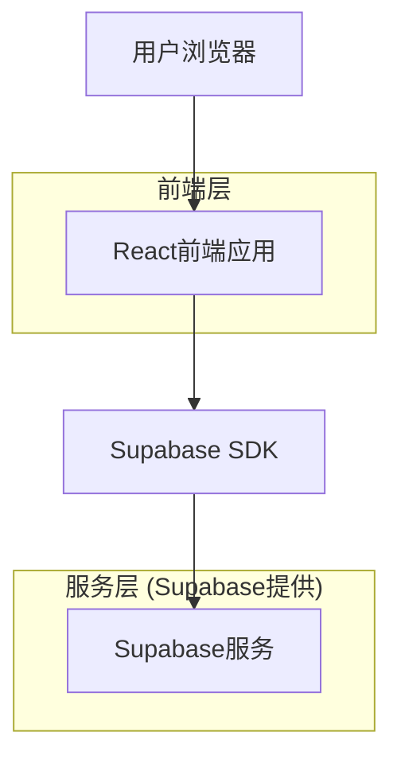
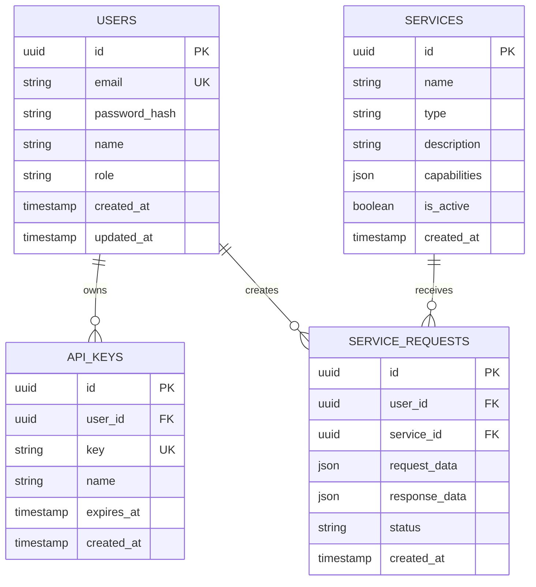

## 1. 架构设计



## 2. 技术描述
- 前端：React@18 + Three.js@0.158 + TailwindCSS@3 + Vite
- 初始化工具：vite-init
- 后端：Supabase (认证 + 数据库 + 存储)
- 3D渲染：Three.js用于RobotTaxi和Robot机器人的3D展示
- 动画库：Framer Motion用于页面动画效果

## 3. 路由定义
| 路由 | 用途 |
|-------|---------|
| / | 主页，展示RobotTaxi和Robot机器人入口 |
| /robot-taxi | RobotTaxi详情页面，展示服务介绍和技术信息 |
| /robot | Robot机器人详情页面，展示机器人能力和应用 |
| /login | 登录页面，用户身份验证 |
| /register | 注册页面，新用户注册 |
| /dashboard | 开发者控制台，API管理和数据统计 |

## 4. API定义

### 4.1 核心API

用户认证相关
```
POST /api/auth/login
```

请求：
| 参数名 | 参数类型 | 是否必需 | 描述 |
|-----------|-------------|-------------|-------------|
| email | string | true | 用户邮箱 |
| password | string | true | 密码 |

响应：
| 参数名 | 参数类型 | 描述 |
|-----------|-------------|-------------|
| token | string | JWT认证令牌 |
| user | object | 用户信息 |

示例：
```json
{
  "email": "developer@example.com",
  "password": "securepassword123"
}
```

服务统计相关
```
GET /api/services/stats
```

响应：
| 参数名 | 参数类型 | 描述 |
|-----------|-------------|-------------|
| robotTaxiCount | number | RobotTaxi服务数量 |
| robotActiveCount | number | 活跃机器人数量 |
| totalDevelopers | number | 注册开发者总数 |

## 5. 数据模型

### 5.1 数据模型定义


### 5.2 数据定义语言

用户表 (users)
```sql
-- 创建表
CREATE TABLE users (
    id UUID PRIMARY KEY DEFAULT gen_random_uuid(),
    email VARCHAR(255) UNIQUE NOT NULL,
    password_hash VARCHAR(255) NOT NULL,
    name VARCHAR(100) NOT NULL,
    role VARCHAR(20) DEFAULT 'developer' CHECK (role IN ('visitor', 'developer', 'enterprise')),
    created_at TIMESTAMP WITH TIME ZONE DEFAULT NOW(),
    updated_at TIMESTAMP WITH TIME ZONE DEFAULT NOW()
);

-- 创建索引
CREATE INDEX idx_users_email ON users(email);
CREATE INDEX idx_users_role ON users(role);
```

服务表 (services)
```sql
-- 创建表
CREATE TABLE services (
    id UUID PRIMARY KEY DEFAULT gen_random_uuid(),
    name VARCHAR(100) NOT NULL,
    type VARCHAR(50) NOT NULL CHECK (type IN ('robot-taxi', 'robot')),
    description TEXT,
    capabilities JSONB,
    is_active BOOLEAN DEFAULT true,
    created_at TIMESTAMP WITH TIME ZONE DEFAULT NOW()
);

-- 初始化数据
INSERT INTO services (name, type, description, capabilities) VALUES
('RobotTaxi Service', 'robot-taxi', '自动驾驶出租车服务', '{"autonomous_driving": true, "real_time_tracking": true, "multi_language": true}'),
('Robot Assistant', 'robot', '智能机器人助手', '{"natural_language": true, "computer_vision": true, "task_automation": true}');
```

API密钥表 (api_keys)
```sql
-- 创建表
CREATE TABLE api_keys (
    id UUID PRIMARY KEY DEFAULT gen_random_uuid(),
    user_id UUID REFERENCES users(id) ON DELETE CASCADE,
    key VARCHAR(255) UNIQUE NOT NULL,
    name VARCHAR(100) NOT NULL,
    expires_at TIMESTAMP WITH TIME ZONE,
    created_at TIMESTAMP WITH TIME ZONE DEFAULT NOW()
);

-- 创建索引
CREATE INDEX idx_api_keys_user_id ON api_keys(user_id);
CREATE INDEX idx_api_keys_key ON api_keys(key);
```

-- 权限设置
GRANT SELECT ON services TO anon;
GRANT ALL PRIVILEGES ON users TO authenticated;
GRANT ALL PRIVILEGES ON api_keys TO authenticated;
GRANT ALL PRIVILEGES ON service_requests TO authenticated;